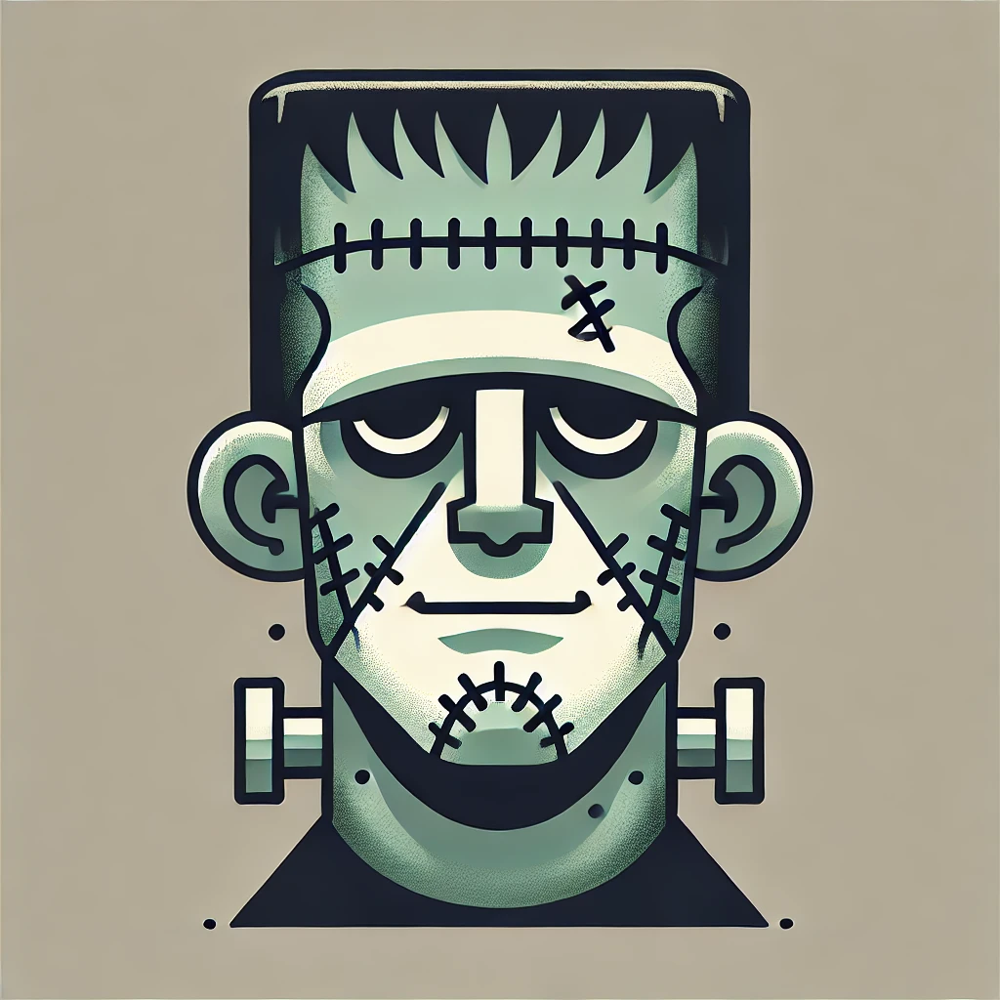

 
  <a href="https://www.linkedin.com/in/kauan-modolo-carriço" target="_blank"> 
  
    

<h1> MONSTER DEX </h1>

# 👨‍💻 O PROJETO
Este é meu primeiro projeto em React JS, na qual experimento as noções básicas de estates e components, bem como o uso de API para ser meu banco de nomes dos monstros. O projeto consiste na projeção de monsters cards com a foto e o nome dos monstros, na qual podem ser filtrados por uma search box.

# 👨‍💻 ABOUT THE PROJECT
This is my first project in React JS, in which I experiment with the basic notions of estates and components, as well as using the API to be my monster name database. The project consists of projecting monster cards with the photo and name of the monsters, which can be filtered through a search box.

# 🚀 TECNOLOGIAS
Essas são as tecnologias utilizadas no projeto:
 
 
REACT JS
